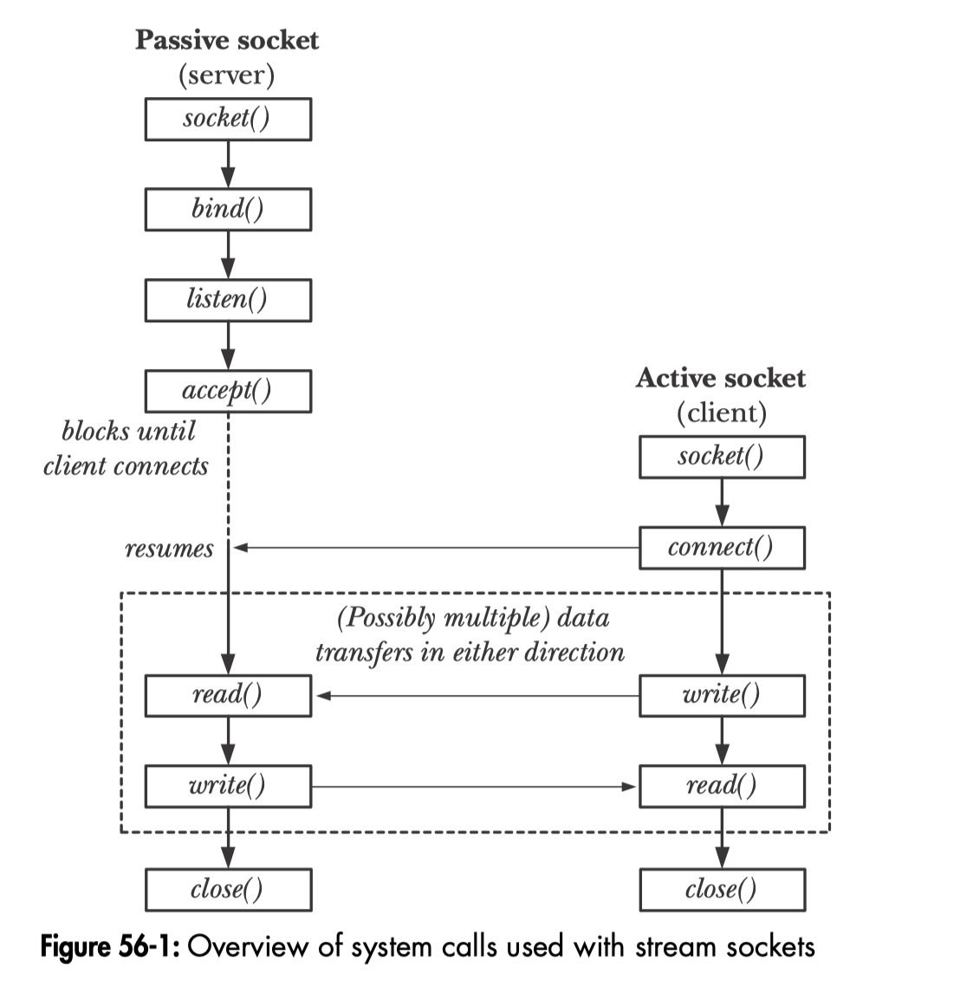
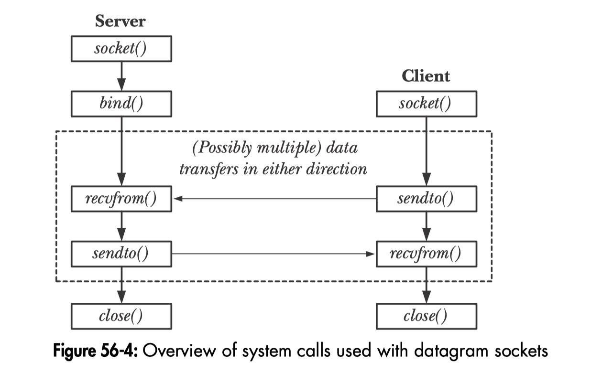

socket使用系统调用创建，返回一个文件描述符，后续的系统调用都使用这个文件描述符来操作socket。

```
fd = socket(domain, type, protocol);
```

domain一般有3种类型：`AF_UNIX`, `AF_INET`, `AF_INET6`，分别对应Unix Socket，IPv4 Socket和IPv6Socket。socket是一种进程间通信的解决方案，并不专指网络通信。

type有两种：`SOCK_STREAM`和`SOCK_DGRAM`。这是两种数据传输的格式，stream类型的建立稳定可靠的连接，消息之间没有边界，也就是流式。dgram类型不需要连接，不保证可靠性，有明显的消息边界，也就是报文式。

流式socket流程:



报文式流程:



在报文上socket上可以connect么？connect会有什么后果？


